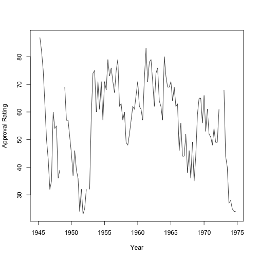

A Summary of Presidential Approval Ratings (1945-1974)
========================================================
author: Steven Durham
date: January 25, 2015

History
========================================================

Approval Ratings were first introduced in the 1930s by the famous pollster George Gallup.

- He wanted to quantify just how much the populace approved of the President of the United States.
- They became ubiquitous during the presidency of Harry Truman.
- Due to polling methodologies and the nature of politics, the results are subjective.

Statistical Summary
========================================================


```r
summary(presidents)
```

```
   Min. 1st Qu.  Median    Mean 3rd Qu.    Max.    NA's 
  23.00   46.00   59.00   56.31   69.00   87.00       6 
```

As you can see in this chart, the lowest approval rating ever recorded is 23, while the highest is 87, and the mean is 56.31. The Office of the President was pretty popular duing this time frame, though it did have it's ugly moments (Watergate).

Overall Approval Rating Over Time
========================================================

 

As you can see from this chart, the American public tends to be a fickle bunch. While no incumbent president lost a re-election bid during this time frame (which implies popularity), there were still times when the approval rating dipped way down.

What does this mean?
========================================================
Approval Ratings are fun for the public, but they don't have much bearing on the direction of elections or the Presidency. For example:

- Harry Truman has the lowest rating ever recorded; even lower than Richard Nixon, who was forced to resign!
- Truman also has the highest rating ever recorded, though that was the very first survey taken, so the methodologies may have been imperfect
- Dwight Eisenhower's approval rating never dropped below 50, but that popularity was still not enough for his Vice President (Richard Nixon) to win the 1960 presidential election.

Conclusion
========================================================
Approval Ratings are fun for history and politics geeks. For more information about individual approval ratings, check out my data product here: https://shdurham.shinyapps.io/Presidential_Approval_Ratings_Developing_Data_Products/
